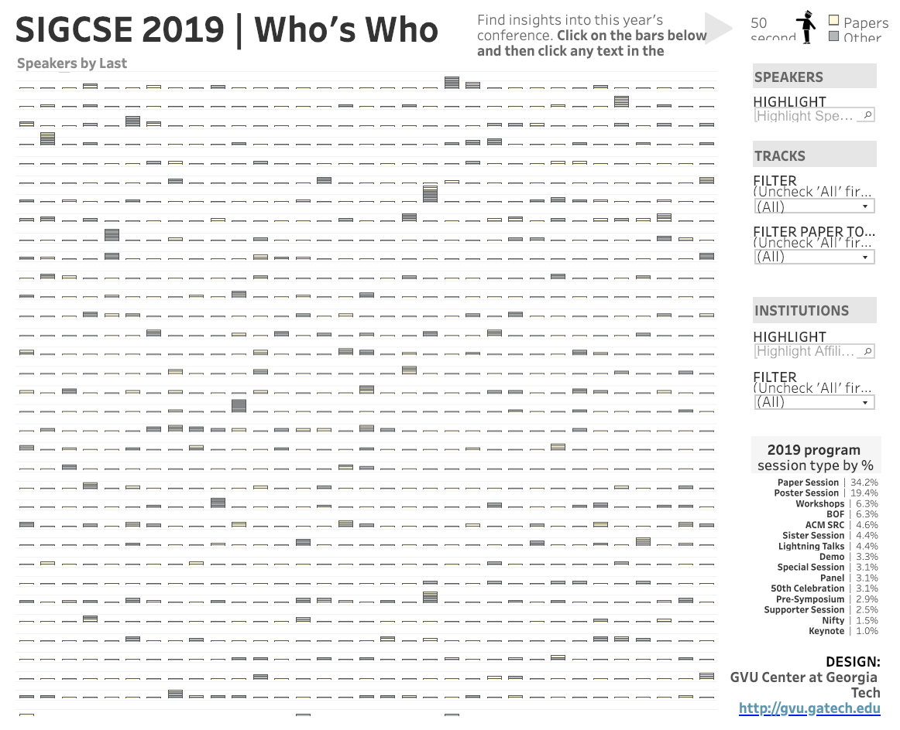
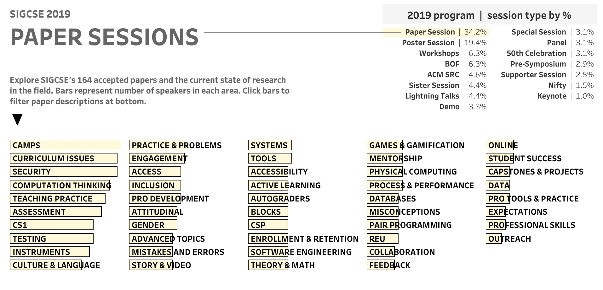
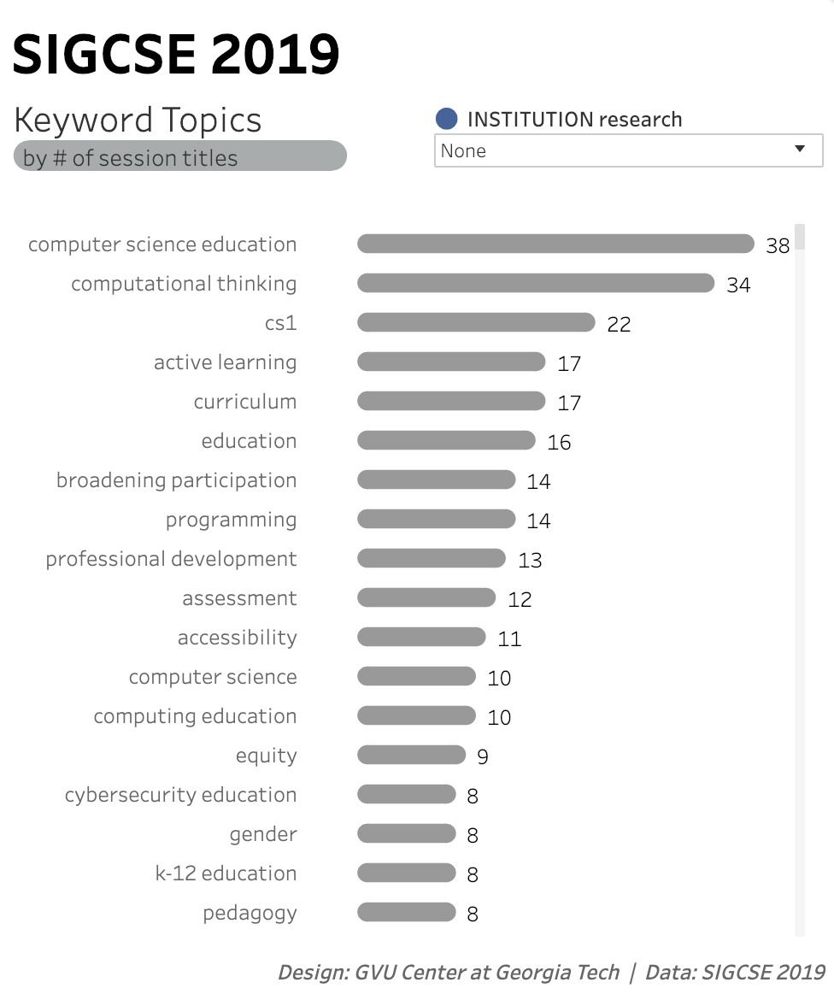

<ul>

<li> <a href="#{{h.link}}">{{h.text}}</a></li>

</ul>

 

Joshua Preston, the Research Communications Officer for the GVU Center and College of Computing at Georgia Institute of Technology, graciously prepared some interesting interactive visualizations of the SIGCSE 2019 data.

Play around with these visualizations, they allow you to explore the schedule in unique ways. We hope you enjoy them.

### Who's Who

[SIGCSE 2019 Who's Who](https://public.tableau.com/views/practice_sigcse/Dashboard3?%3Aembed=y&%3Adisplay_count=yes&publish=yes&%3AshowVizHome=no#2)

### Papers

[SIGCSE 2019 Papers](
https://public.tableau.com/views/SIGCSE2019Papers/Dashboard1?:embed=y&:display_count=yes&publish=yes&:showVizHome=no)

### Keywords

[SIGCSE 2019 Keywords](https://public.tableau.com/views/sigcse2019keywords/Dashboard1?:embed=y&:display_count=yes&publish=yes&:showVizHome=no)

