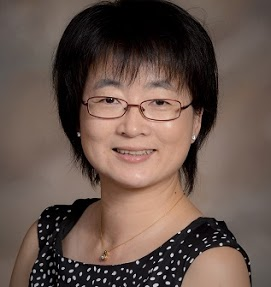
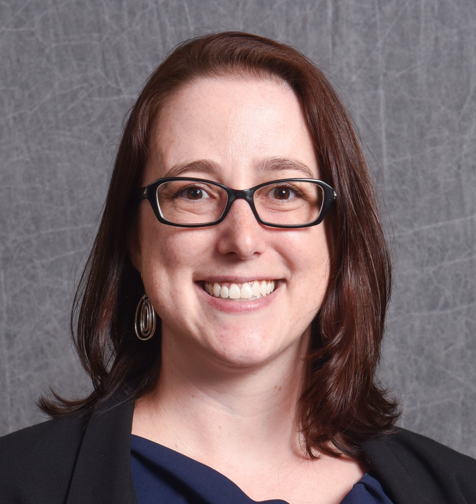
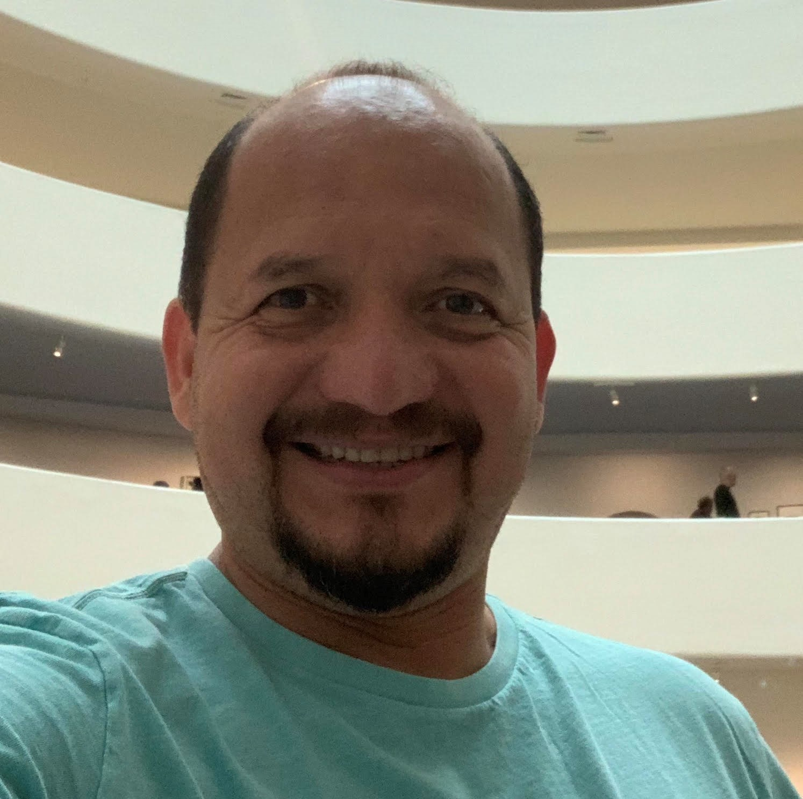

## SIGCSE 2020 Chairs Welcome!

Welcome to SIGCSE 2020 -- the online version!  While we couldn't meet in person this year due to the COVID-19 pandemic, we are pleased to bring our community together around the awesome papers, submissions, presentations, and materials that our global colleagues prepared for you.  We hope that as we move into the summer months that this online portal of SIGCSE 2020 materials will provide the inspiration, resources, and support that you have come to expect from the SIGCSE Technical Symposium.  

We invite you to engage online, through <a href="{{site.data.social.twitter}}" target="_blank"> Twitter</a> (use #sigcse2020online), <a href="{{site.data.social.facebook}}" target="_blank"> Facebook</a>, or Whova!

We wish you all the best and look forward to gathering together in person for [SIGCSE 2021](https://sigcse2021.org) in Toronto, Cananda! 

  

  
  

### SIGCSE 2020 Supporters

Thank you to our SIGCSE 2020 Supporters for making the annual Technical Symposium possible!

Several supporters provided content from their planned sessions as part of SIGCSE 2020 Online. Their sessions can be found on the [Supporters Page](supporters.html).

  

  <h4 class="text-center" style="text-shadow: 1px 1px 1px; border-bottom: 1px solid #ccc;">Platinum Supporters</h4>
  

  

    

	  <h5 class="text-center" style="margin-top: -25px; color: black;">GitHub Education</h5>
	  
	

  

  

    

	  <h5 class="text-center" style="margin-top: -25px; color: black;">Google</h5>
	  
	

  

  

    

	  <h5 class="text-center" style="margin-top: -25px; color: black;">Intel</h5>
	  
	

  

  

    

	  <h5 class="text-center" style="margin-top: -25px; color: black;">Microsoft</h5>
	  
	

  

  

  <h4 class="text-center" style="text-shadow: 1px 1px 1px; border-bottom: 1px solid #ccc;">Gold Supporters</h4>
  

  

    

	  <h5 class="text-center" style="margin-top: -25px; color: black;">Gradescope by Turnitin</h5>
	  
	

  

  

    

	  <h5 class="text-center" style="margin-top: -25px; color: black;">Codio</h5>
	  
	

  

  

    

	  <h5 class="text-center" style="margin-top: -25px; color: black;">National Science Foundation</h5>
	  
	

  

  

    

	  <h5 class="text-center" style="margin-top: -25px; color: black;">Rephactor</h5>
	  
	

  

  

    

	  <h5 class="text-center" style="margin-top: -25px; color: black;">Turing's Craft</h5>
	  
	

  

  

    

	  <h5 class="text-center" style="margin-top: -25px; color: black;">zyBooks</h5>
	  
	

  

  

  <h4 class="text-center" style="text-shadow: 1px 1px 1px; border-bottom: 1px solid #ccc;">Silver Supporters</h4>
  

  

    

	  <h5 class="text-center" style="margin-top: -25px; color: black;">ABET</h5>
	  
	

  

  

    

	  <h5 class="text-center" style="margin-top: -25px; color: black;">AWS Educate</h5>
	  
	

  

  

    

	  <h5 class="text-center" style="margin-top: -25px; color: black;">IBM</h5>
	  
	

  

  

  <h4 class="text-center" style="text-shadow: 1px 1px 1px; border-bottom: 1px solid #ccc;">Bronze Supporters</h4>
  

  

    

	  <h5 class="text-center" style="margin-top: -25px; color: black;">AnitaB.org</h5>
	  
	

  

### SIGCSE 2020 Submission and Acceptance Statistics

SIGCSE 2020 broke submission records with over 1109 submissions!  We can't thank our community enough for their hard work in submitting and reviewing!

The SIGCSE Symposium promotes high-quality scholarship and community engagement around computer science education. We continued the practice of reviewer discussions, an expanded associate program committee, and three paper submissions tracks, recognizing the differences in scope and review criteria between (1) CS education research, (2) experience reports and tools, and (3) curriculum initiatives. Over 850 reviewers provided each Paper with at least 3 reviews; and all other submissions with at least 2 reviews. Reviewers, along with 75 Associate Program Chairs and 14 Track Chairs, discussed submissions to come to a consensus. Program Chairs made final selections based on recommendations, importance, novelty, and timeliness.  

{:class="table table-bordered"}
| Track | # Submitted | # Accepted | Acceptance Rate |
|-------|------------:|-----------:|----------------:|
| Papers (CS Education Research, Experience Reports and Tools, Curriculum Initiatives) | 544 | 171 | 31% |
| Panels | 54 | 26 | 48% |
| Special Sessions | 33 | 12 | 36% |
| Workshops | 64 | 30 | 47% |
| ACM Student Research Competition | 44 | 26 | 59% |
| Birds of a Feather | 85 | 30 | 35% |
| Demos | 30 | 10 | 33% |
| Lightning Talks | 41 | 20 | 49% |
| Nifty Assignments | 30 | 6 | 20% |
| Posters | 184 | 115 | 63% |

### Best Papers

This year the Program Chairs selected three best papers from each of the paper tracks for their accomplishment of high quality, exemplifying the expectations of the track, novelty and broad appeal to reviewers. All best papers received at least one nomination from reviewers, high ratings, and excellent comments from reviewers. The top three papers in each track are shown below and highlighted throughout the printed program.

#### CS Education Research Best Papers

**1st Best Paper:** [Competitive Enrollment Policies in Computing Departments Negatively Predict First-Year Students' Sense of Belonging, Self-Efficacy, and Perception of Department](papers.html#cser1)

  An Nguyen, _Harvey Mudd College_; Colleen M. Lewis, _Harvey Mudd College_

**2nd Best Paper:** [Dual-Modality Instruction and Learning: A Case Study in CS1](papers.html#cser2)

  Jeremiah Blanchard, _University of Florida_; Christina Gardner-McCune, _University of Florida_; Lisa Anthony, _University of Florida_

**3rd Best Paper:** [What Are Cybersecurity Education Papers About? A Systematic Literature Review of SIGCSE and ITiCSE Conferences](papers.html#cser3)

  Valdemar Švábenský, _Masaryk University_; Jan Vykopal, _Masaryk University_; Pavel Čeleda, _Masaryk University_

#### Experience Reports and Tools

**1st Best Paper:** [Applying NCWIT Protocol to Broaden Participation in Computing: A Case Study of CS@Mines](papers.html#ert1)

Tracy Camp, _Colorado School of Mines_; Christine Liebe, _Colorado School of Mines_; Michelle Slattery, _Peak Research, NCWIT ES Consultant_

**2nd Best Paper:** [A Comparison of Two Pair Programming Configurations for Upper Elementary Students](papers.html#ert2)

Jennifer Tsan, _North Carolina State University_; Jessica Vandenberg, _North Carolina State University_; Zarifa Zakaria, _North Carolina State University_; Joseph B. Wiggins, _University of Florida_; Alexander R. Webber, _University of Florida_; Amanda Bradbury, _North Carolina State University_; Collin Lynch, _North Carolina State University_; Eric N. Wiebe, _North Carolina State University_; Kristy Elizabeth Boyer, _University of Florida_

**3rd Best Paper:** [Reviewing CS1 Materials through a Collaborative Software Engineering Exercise: An Experience Report](papers.html#ert3)

Jessica Young Schmidt, _North Carolina State University_

#### Curricula Initiatives

**1st Best Paper:** [Design Principles behind Beauty and Joy of Computing](papers.html#ci1)

Paul Goldenberg, _Education Development Center_; June Mark, _Education Development Center_; Brian Harvey, _University of California, Berkeley_; Al Cuoco, _Education Development Center_; Mary Fries, _Education Development Center_

**2nd Best Paper:** [Teaching Autonomous Systems at 1/10th-scale: Design of the F1/10 Racecar, Simulators and Curriculum](papers.html#ci2)

Abhijeet Agnihotri, _Oregon State University_; Matthew O'Kelly, _University of Pennsylvania_; Houssam Abbas, _Oregon State University_; Rahul Mangharam, _University of Pennsylvania_

**3rd Best Paper:** [Creating a Balanced Data Science Program](papers.html#ci3)

Joel C. Adams, _Calvin University_

### SIGCSE 2020 Chairs

<strong>Jian Zhang</strong> 
Symposium Co-Chair 
Texas Woman's University 

<strong>Mark Sherriff</strong> 
Symposium Co-Chair 
University of Virginia 

<strong>Sarah Heckman</strong> 
Program Co-Chair 
NC State University 

<strong>Alvaro Monge</strong> 
Program Co-Chair 
California State University, Long Beach 

<strong>Pam Cutter</strong> 
Program Co-Chair 
Kalamazoo College 

